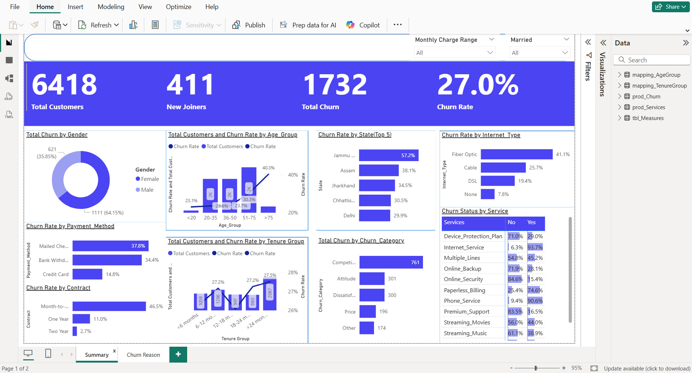
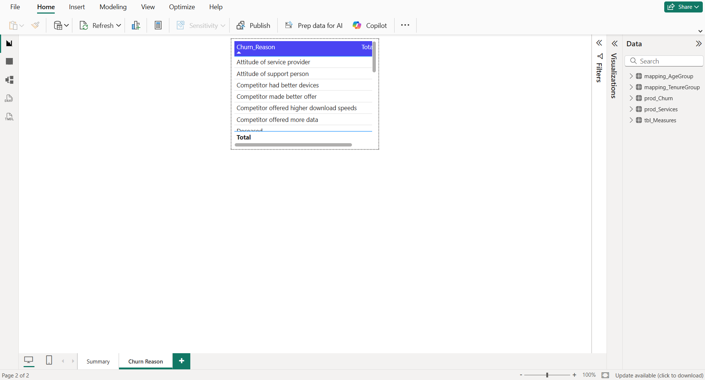

# Customer Churn Analytics Dashboard

## Overview

This project analyzes customer churn data using **SQL Server** and **Power BI** to identify customer retention patterns and provide actionable business insights. The workflow covers data cleaning, exploratory analysis, data modeling, and interactive dashboard development to support data-driven decision-making.

---

## Business Problem

Customer churn directly impacts revenue and customer lifetime value. The objective of this project is to analyze customer behavior and identify factors associated with customer attrition to support effective retention strategies.

---

## Tools & Technologies

- SQL Server
- Power BI
- DAX
- Power Query

---

## Project Workflow

### 1. Data Cleaning

- Identified missing values
- Standardized categorical variables using `ISNULL()`
- Prepared clean datasets for reporting and analysis

### 2. Exploratory Data Analysis

Analyzed customer characteristics including:

- Gender
- Age
- State
- Contract Type
- Internet Service
- Payment Method
- Customer Status
- Revenue

using SQL queries with:

- Aggregate Functions
- GROUP BY
- ORDER BY
- Filtering

### 3. Data Modeling

Created SQL Views to separate:

- Active & Churned Customers
- Newly Joined Customers

for efficient reporting in Power BI.

### 4. Dashboard Development

Developed an interactive Power BI dashboard featuring:

- Executive KPI Cards
- Customer Churn Rate
- Churn by Contract
- Churn by Internet Type
- Churn by Payment Method
- Churn by Tenure
- Churn by Age Group
- Churn Categories
- Customer Service Analysis
- Churn Reason Analysis

---

## Dashboard Preview

### Executive Dashboard



### Churn Reason Dashboard



---

## Key Insights

- Month-to-month contracts experience the highest churn.
- Fiber Optic customers have higher churn rates than other internet service users.
- Competitor-related factors are the leading causes of customer churn.
- Customer tenure influences churn behavior.
- Payment method and service subscriptions are associated with different churn rates.

---

## Skills Demonstrated

- SQL
- SQL Server
- Data Cleaning
- Data Analysis
- Power BI
- DAX
- Power Query
- Dashboard Development
- Data Visualization
- Business Intelligence

---

## Repository Structure

```
Customer-Churn-Analysis
│
├── Data
├── Images
├── Power-BI
├── SQL
│   ├── cleaning_nulls.sql
│   ├── db_churn_data_analysis.sql
│   └── db_churn_views_data_analysis.sql
├── README.md
└── LICENSE
```
---
## Status & Next Steps
This project is actively being extended. Currently working on a machine learning model to predict customer churn based on the patterns identified in this analysis.
